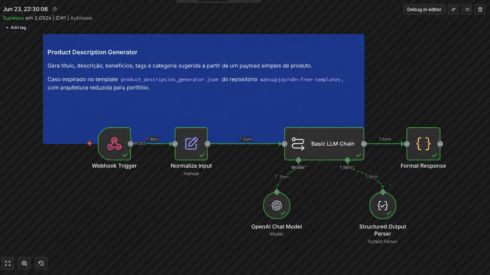
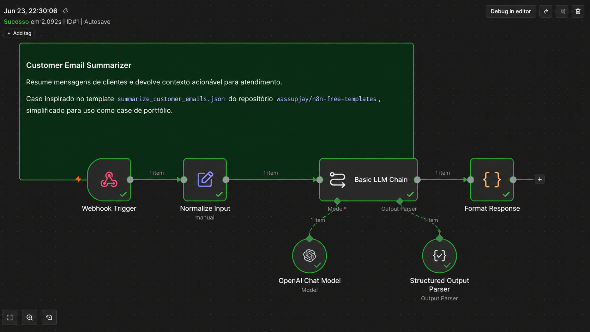
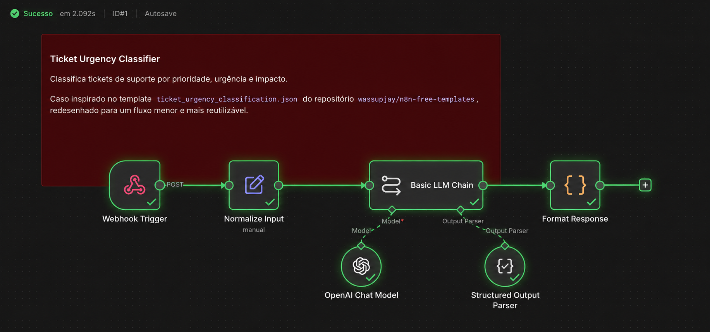

# EPMartins Automation Lab


Laboratório de automações com IA e n8n para resolver problemas reais de negócio.

## Visão geral

Este repositório reúne workflows práticos de automação com IA, n8n e integrações orientados a cenários reais de operação, atendimento e e-commerce. A proposta é demonstrar como combinar entrada estruturada, modelos de linguagem, regras de negócio e saídas acionáveis em fluxos claros, testáveis e fáceis de evoluir.

## Por que este projeto existe

Este projeto existe para demonstrar automação aplicada com foco em produto, integração entre APIs, uso pragmático de IA e documentação clara. Mais do que publicar arquivos JSON de n8n, a ideia é apresentar casos de uso completos, com contexto de negócio, exemplos de entrada e saída, estrutura previsível e material suficiente para avaliação técnica.

## Workflows disponíveis

| Workflow | Problema de negócio | Saída principal | Tecnologias | Status |
| --- | --- | --- | --- | --- |
| [Product Description Generator](workflows/product-description-generator) | Criar descrições melhores para produtos de marketplace com mais rapidez. | Título otimizado, descrição comercial, benefícios, tags e sugestão de categoria. | n8n, modelo de IA, Webhook, JSON | MVP |
| [Customer Email Summarizer](workflows/customer-email-summarizer) | Reduzir o tempo gasto lendo e triando mensagens de clientes. | Resumo, assunto principal, sentimento, urgência e ação sugerida. | n8n, modelo de IA, e-mail/webhook, JSON | MVP |
| [Ticket Urgency Classifier](workflows/ticket-urgency-classifier) | Priorizar tickets de suporte com base em urgência e impacto no negócio. | Prioridade, urgência, impacto, sentimento e sugestão de encaminhamento. | n8n, modelo de IA, Webhook, JSON | MVP |

## Demonstração rápida

Cada workflow deste laboratório foi estruturado como um case técnico completo, não apenas como um arquivo JSON isolado.

Cada automação possui:

- Payload de exemplo para teste
- Saída esperada documentada
- Workflow JSON importável no n8n
- Explicação do problema de negócio
- Ideias de evolução para cenários reais

Isso permite avaliar rapidamente o raciocínio por trás da automação, a estrutura técnica do fluxo e o problema de negócio que ela procura resolver.

## Previews visuais

Os workflows foram pensados para receber previews visuais dentro da pasta [`assets/`](assets/).

Status atual:

- [x] Capturas dos fluxos no n8n
- [ ] Diagramas simples de arquitetura
- [ ] Exemplos visuais de entrada e saída
- [ ] Prints de integrações com ferramentas externas

A pasta `assets/` está reservada para complementar a leitura técnica com material visual do projeto.

Preview disponível no momento:

### 1. Product Description Generator

Geração estruturada de título, descrição, benefícios, tags e categoria sugerida para produtos de marketplace.



### 2. Customer Email Summarizer

Resumo operacional de mensagens de clientes com identificação de assunto, urgência, sentimento e ação sugerida.



### 3. Ticket Urgency Classifier

Classificação de tickets por prioridade, urgência e impacto para apoiar a triagem inicial de suporte.



## Estrutura do repositório

```text
epmartins-automation-lab/
  README.md
  LICENSE
  .gitignore
  workflows/
    product-description-generator/
      workflow.json
      README.md
      sample-input.json
      sample-output.md
    customer-email-summarizer/
      workflow.json
      README.md
      sample-input.json
      sample-output.md
    ticket-urgency-classifier/
      workflow.json
      README.md
      sample-input.json
      sample-output.md
  docs/
    how-to-import.md
    credentials.md
    architecture.md
    roadmap.md
    validation-checklist.md
  assets/
    .gitkeep
```

## Como importar os workflows

O passo a passo está em [docs/how-to-import.md](docs/how-to-import.md).

## Credenciais necessárias

As credenciais e placeholders esperados estão em [docs/credentials.md](docs/credentials.md).

> Nenhuma credencial real, token ou chave de API está versionada neste repositório. Os workflows usam placeholders e devem ser configurados diretamente no ambiente seguro do n8n.

## Arquitetura

A visão geral da arquitetura dos fluxos está em [docs/architecture.md](docs/architecture.md).

## Roadmap

Os próximos passos planejados estão em [docs/roadmap.md](docs/roadmap.md).

## Checklist de validação

O checklist técnico de revisão e validação está em [docs/validation-checklist.md](docs/validation-checklist.md).

## Créditos

Este projeto foi inspirado em templates abertos de automação da comunidade n8n, incluindo o repositório `wassupjay/n8n-free-templates`. Os workflows foram adaptados, curados e documentados como casos de uso orientados a problemas reais de negócio.

## Sobre mim

Criado por Eduardo Pires Martins — Desenvolvedor de Software com foco em backend, APIs, integrações, produtos digitais e tecnologia orientada a negócios.

Portfólio: https://www.epmartins.com.br  
LinkedIn: https://www.linkedin.com/in/eduardopiresmartins/  
GitHub: https://github.com/eduardopiresmartins
